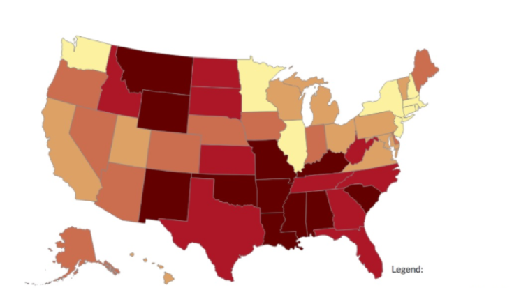
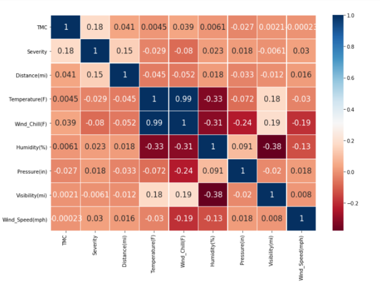
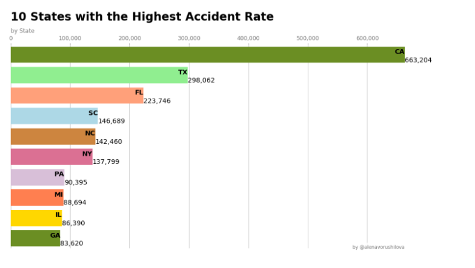
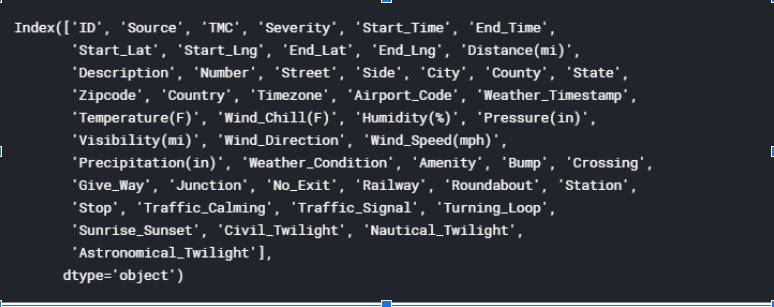

## Susan Young
## Tricia Miller

# Traffic Accident Analysis

# Dataset: https://www.kaggle.com/sobhanmoosavi/us-accidents
Citations 1 & 2

Analyze traffic accident data to uncover correlations between associated metrics. Provide visualizations to tell the story of the correlations in traffic data. Attributes analyzed time, severity, by location, weather and day or night.

Will likely reduce dataset by time or location depending on initial cleansing and analysis.

# Final analysis:
 
  * Will be located in GitHub repo: https://github.com/evansvillewy/Project-2
  * Will be deployed to a public web hosting site.
  * Provide insights into the US Traffic Accident data
  * Data will be stored in a database
  * Data/analysis will be delivered via web dashboard pages
  * Allow for drilling into the US Traffic data interactively

# Inspiration
Citation 3

# Data Description
This is a countrywide car accident dataset, which covers __49 states of the United States__. The accident data are collected from __February 2016 to December 2019__, using several data providers, including two APIs that provide streaming traffic incident data. These APIs broadcast traffic data captured by a variety of entities, such as the US and state departments of transportation, law enforcement agencies, traffic cameras, and traffic sensors within the road-networks. Currently, there are about __3.0 million__ accident records in this dataset. 

# Metadata:

# Acknowledgements
Citations:
  * 1. Moosavi, Sobhan, Mohammad Hossein Samavatian, Srinivasan Parthasarathy, and Rajiv Ramnath. “A Countrywide Traffic Accident Dataset.”, 2019.
  * 2. Moosavi, Sobhan, Mohammad Hossein Samavatian, Srinivasan Parthasarathy, Radu Teodorescu, and Rajiv Ramnath. "Accident Risk Prediction based on Heterogeneous Sparse Data: New Dataset and Insights." In proceedings of the 27th ACM SIGSPATIAL International Conference on Advances in Geographic Information Systems, ACM, 2019.
  * 3. https://www.kaggle.com/alenavorushilova/us-car-accidents-visualization