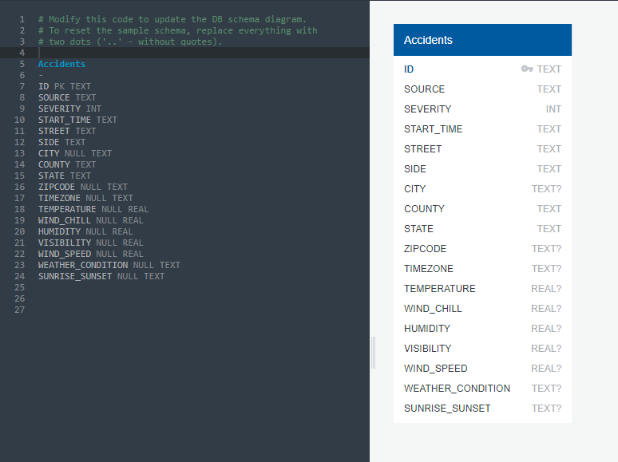

### Susan Young
### Tricia Miller

# Traffic Accident Analysis

# Dataset: https://www.kaggle.com/sobhanmoosavi/us-accidents
Citations 1 & 2

Analyze traffic accident data to uncover correlations between associated metrics. Provide visualizations to tell the story of the correlations in traffic data. Attributes analyzed time, severity, by location, weather and day or night.

Will likely reduce dataset by time or location depending on initial cleansing and analysis.

# Final analysis:
 
  * Will be located in GitHub repo: https://github.com/evansvillewy/Project-2
  * Will be deployed to a public web hosting site.
  * Provide insights into the US Traffic Accident data
  * Data will be stored in a database
  * Data/analysis will be delivered via web dashboard pages
  * Allow for drilling into the US Traffic data interactively

# Inspiration
Citation 3

# Data Description
This is a countrywide car accident dataset, which covers __49 states of the United States__. The accident data are collected from __February 2016 to December 2019__, using several data providers, including two APIs that provide streaming traffic incident data. These APIs broadcast traffic data captured by a variety of entities, such as the US and state departments of transportation, law enforcement agencies, traffic cameras, and traffic sensors within the road-networks. Currently, there are about __3.0 million__ accident records in this dataset. 

# Metadata:

# SQLite Data Model

We reduced the source dataset down to just the data we needed for our analysis. we loaded this into SQLite.

# Acknowledgements
Citations:
  * 1. Moosavi, Sobhan, Mohammad Hossein Samavatian, Srinivasan Parthasarathy, and Rajiv Ramnath. “A Countrywide Traffic Accident Dataset.”, 2019.
  * 2. Moosavi, Sobhan, Mohammad Hossein Samavatian, Srinivasan Parthasarathy, Radu Teodorescu, and Rajiv Ramnath. "Accident Risk Prediction based on Heterogeneous Sparse Data: New Dataset and Insights." In proceedings of the 27th ACM SIGSPATIAL International Conference on Advances in Geographic Information Systems, ACM, 2019.
  * 3. https://www.kaggle.com/alenavorushilova/us-car-accidents-visualization

  # Git LFS - Large File Storage

  https://git-lfs.github.com/ - 

  1. Download and install the Git command line extension. Once downloaded and installed, set up Git LFS for your user account by running:

    git lfs install
    You only need to run this once per user account.

  2. In each Git repository where you want to use Git LFS, select the file types you'd like Git LFS to manage (or directly edit your .gitattributes). You can configure additional file extensions at anytime.

    git lfs track "*.csv"
    Now make sure .gitattributes is tracked:

    git add .gitattributes

    Note that defining the file types Git LFS should track will not, by itself, convert any pre-existing files to Git LFS, such as files on other branches or in your prior commit history. To do that, use the git lfs migrate[1] command, which has a range of options designed to suit various potential use cases.

  3. There is no step three. Just commit and push to GitHub as you normally would.

    git add *.csv
    git commit -m "Add data file"
    git push origin master